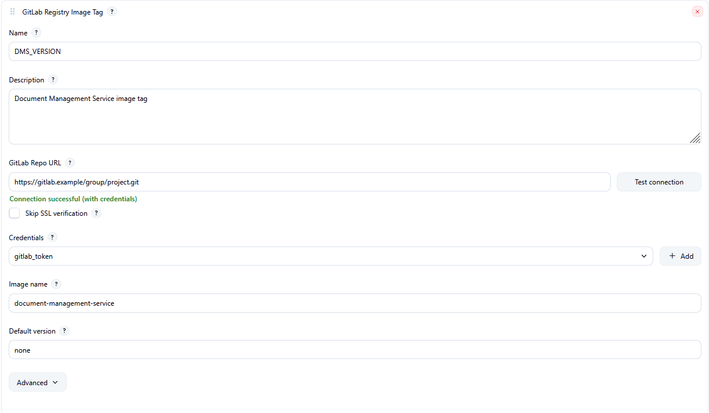
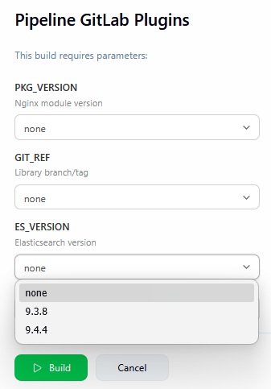

# GitLab Registry Image Parameter

Pick a **container image tag** from a GitLab project’s Container Registry when you start a build — no hard-coded versions in the job config.

Pipeline symbol: `gitLabRegistryImage`

## Screenshots

### Configure the parameter

Point the job at a GitLab project, choose the image name, and verify access with **Test connection**.



### Build with Parameters

Tags load on demand when you open the build form; choose a tag and run the job.



## Why this plugin

- Lists tags via **GitLab project APIs** (project URL + image name), not a generic Docker Registry host/path.
- Works with **self-hosted GitLab** and usual Jenkins credentials (token / username+password).
- **Lazy loading** on the Build with Parameters page — the job form stays fast until you need the list.
- **Test connection** on the config screen before the first build.

### Not a duplicate of…

| Plugin | Difference |
|--------|------------|
| [Image Tag Parameter](https://plugins.jenkins.io/image-tag-parameter) | Talks to a Docker Registry HTTP API. This plugin uses GitLab’s project + registry APIs. |
| [Quay Tag Parameter](https://plugins.jenkins.io/quay-tag-parameter) | Quay-specific. This plugin is GitLab-only. |
| [ORAS Parameters](https://plugins.jenkins.io/oras-parameters) | OCI / ORAS artifact refs. This plugin lists Container Registry **image tags** for a GitLab project. |
| [GitLab Plugin](https://plugins.jenkins.io/gitlab-plugin) | MRs, webhooks, SCM. This plugin is only a build-parameter dropdown. |

### Sibling plugins

Same UI patterns, different GitLab APIs:

- [gitlab-package-registry-parameter-plugin](https://github.com/mlinops/gitlab-package-registry-parameter-plugin) — Package Registry versions
- [gitlab-repository-refs-parameter-plugin](https://github.com/mlinops/gitlab-repository-refs-parameter-plugin) — branches / tags

## Quick start

1. Add a Jenkins credential (**Username with password** or **Secret text** / PAT). For private projects, scopes are typically `read_registry` / `read_api`.
2. In the job: **This project is parameterized** → **Add Parameter** → **GitLab Registry Image Tag**.
3. Set **Name**, **GitLab Repo URL**, **Image name**; optionally pick credentials and click **Test connection**.
4. Open **Build with Parameters**, wait for the dropdown to load, select a tag, build.

## Pipeline example

Generate from **Pipeline Syntax** → Sample Step **`properties: Set job properties`** → parameterized job → **GitLab Registry Image Tag**.

Required: `name`, `repoUrl`, `imageName`. Other fields are optional.

```groovy
properties([
  parameters([
    gitLabRegistryImage(
      name: 'ES_VERSION',
      repoUrl: 'https://gitlab.example/group/project.git',
      imageName: 'elasticsearch',
      credentialsId: 'gitlab_token',
      defaultVersion: 'none'
    )
  ])
])
```

Replace `gitlab.example` with your GitLab host.

More templates: [`examples/PipelineSyntax.gitLabRegistryImage.groovy`](examples/PipelineSyntax.gitLabRegistryImage.groovy), [`examples/Jenkinsfile.images.plugin`](examples/Jenkinsfile.images.plugin)

## Requirements

- Jenkins **2.541.3** or newer (see `pom.xml`)
- Optional credentials as above

## Configuration fields

| Field | Description |
|-------|-------------|
| `name` | **Required.** Environment variable name (e.g. `ES_VERSION`) |
| `repoUrl` | **Required.** Project URL (`http://` or `https://`) |
| `imageName` | **Required.** Image name in the project registry |
| `description` | Optional help text on the Build with Parameters page |
| `credentialsId` | Optional. Empty = public project |
| `skipSslVerification` | Optional. Disable TLS verification (self-signed) — **insecure** |
| `defaultVersion` | Optional preselected value; added to the list if missing |
| `exclude` / `regex` | Optional Java regex to drop / keep tags |
| `perPage` | Values per API page (1–100, default 50) |
| `maxPages` | Max pages to fetch (1–50, default 2) |
| `maxRows` | Max values in the dropdown (1–500, default 30) |
| `sortMode` | `NONE` / `ASC` / `DESC` / `*_SMART` |
| `connectTimeoutMs` / `readTimeoutMs` | HTTP timeouts |

## Security notes

- Build-page AJAX sends only the parameter name (values come from the job’s stored definition).
- `skipSslVerification=true` enables trust-all TLS — use only for trusted internal GitLab.
- Loopback, link-local, and cloud metadata addresses are blocked. Private RFC1918 hosts are allowed for typical self-hosted GitLab.

## License

MIT — see [`LICENSE`](LICENSE).

## Reporting security issues

See [`SECURITY.md`](SECURITY.md).
